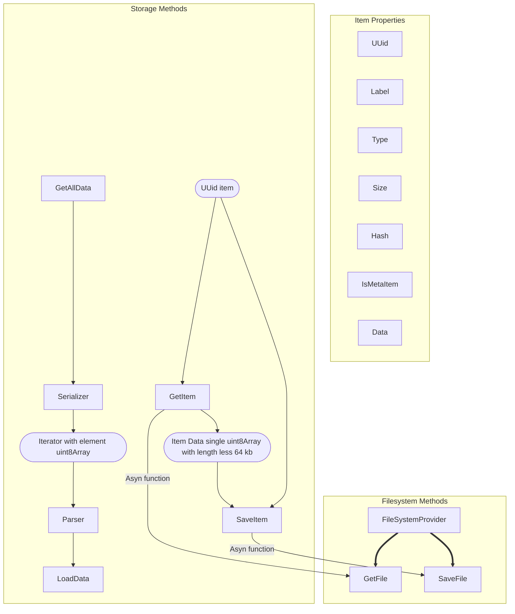

# Storage Member

```mermaid
flowchart TD
    subgraph Filesystem Methods
        GetFile
        SaveFile
        FileSystemProvider ==> GetFile
        FileSystemProvider ==> SaveFile
    end

    subgraph Item Properties
        UUid
        Label
        Type
        Size
        Hash
        IsMetaItem
        Data
    end

    subgraph Storage Methods
        UUID([UUid item])
        DATA([Item Data single uint8Array with length less 64 kb])
        UUID --> GetItem --> DATA
        UUID --> SaveItem
        DATA --> SaveItem

        GetItem -->|Asyn function| GetFile
        SaveItem -->|Asyn function| SaveFile

        GetAllData --> Serializer --> IteratorData([Iterator with element uint8Array])
        IteratorData([Iterator with element uint8Array]) --> Parser --> LoadData
    end

```